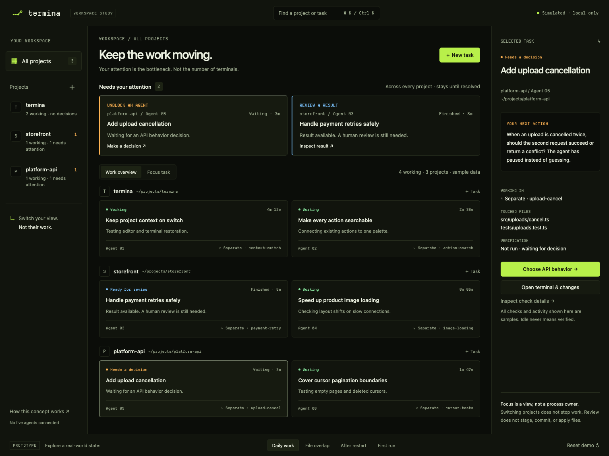
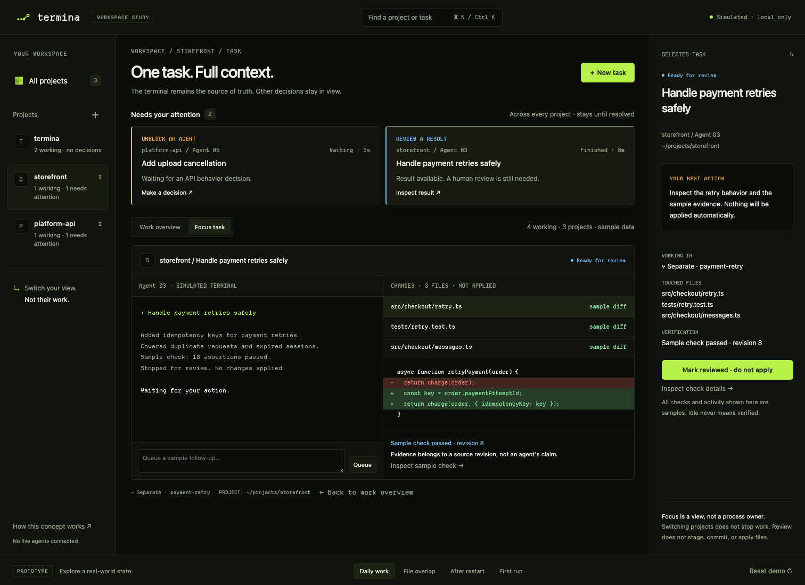
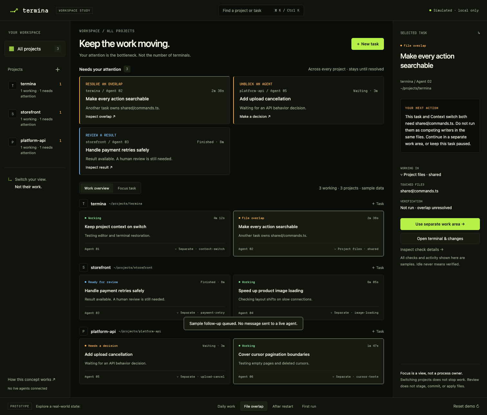

# Termina workspace concept

An interactive, presentation-only mockup accompanying the [product, UI/UX, and developer-experience audit](../../reference/WORKSPACE-EXPERIENCE-AUDIT.md). The [attention-first workspace proposal](../../plans/attention-first-workspace.md) records the recommended product direction, workflows, and rollout priorities.

## Open it

Open `index.html` directly in a modern browser. No development server, build, credentials, or running Termina instance is required.

From the repository root on macOS:

```sh
open docs/mockups/workspace/index.html
```

The page imports the existing `src/styles.css` tokens and font files. Keep it in this repository; moving only this directory elsewhere breaks those relative assets. It uses system sans-serif for task text and the app's Departure Mono for chrome and code, without defining another theme.

## Try the concept

1. Start at **All projects**: three sample projects, six tasks, two outstanding attention items.
2. Filter to **termina**. Notice that the other projects' decisions remain visible and sample work is retained.
3. Select **Add upload cancellation** and choose repeated-cancellation behavior: 204 or 409.
4. Select **Handle payment retries safely**, inspect its terminal, files, diffs and check details, then mark it reviewed. Nothing is applied.
5. Queue a **New task** with a project and outcome. Queued is distinct from a running agent.
6. Use **Cmd/Ctrl+K**, type a task/project, Tab to a result and press Enter.
7. Explore **File overlap**, **After restart**, and **First run** in the bottom scenario controls.
8. Use **Reset demo** or reload to restore sample state.

All labels, commands, checks, diffs, work areas, terminal output and activity are simulated. The page does not call Electron, start agents, connect providers, access the network, create sandboxes, write files, stage, commit or apply changes. “Separate work area” illustrates a proposed interaction; it is not implemented storage or isolation. Only page memory changes. No persistence is promised.

## Preview

### Cross-project work and attention



### Focus a task without losing other decisions



### Resolve source overlap before competing writes



## Verify and regenerate screenshots

Use the repository's existing Playwright development dependency and an installed Chromium browser:

```sh
node docs/mockups/workspace/verify.mjs
node docs/mockups/workspace/verify.mjs --screenshots
```

If Chromium is not installed, install it explicitly with `pnpm exec playwright install chromium` before running the check. This downloads a browser; viewing the mockup itself does not require Playwright.

The script creates and closes its own headless browser. It opens only the local page and checks interactions, project/task attribution, dialog focus return, keyboard search, escaped user content, narrow layouts, basic production theme rendering, and reduced motion. It rejects browser/CSP errors and external requests. It does not launch Electron or touch host agent/session data.

The screenshots are intentional deliverables. Other generated app test artifacts are not part of this mockup.

## Production boundary

This directory is not included in Vite's app build or the packaged renderer. It deliberately does not invent new application IPC, orchestration, session storage, snapshot operations, or preference state. The audit specifies the existing owners a production implementation should extend and the trust issues to fix first.
